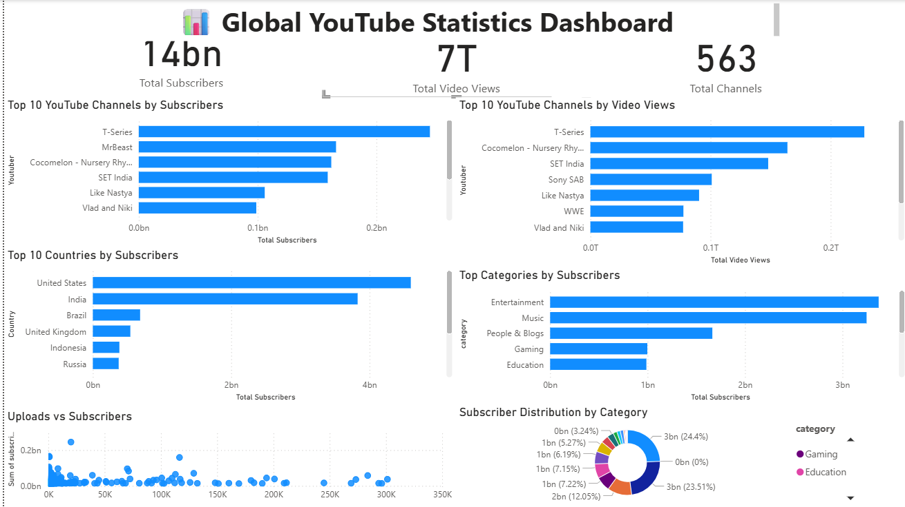

#Global youtube statistics 2023
#Objective:Analyze youtube global statistics 2023 using sql to discover buisness insights

#Tools
-Mysql
-powerbi
-excel
-github

#Datasets
-Global Youtube statistics 2023(kaggle),
-Records:995 Channels
-Database:MySQL

#Project cover
- Data Cleaning
- Exploratory Data Analysis
- Business Analysis
- Window Functions
- CTEs
- Views
- Stored Procedures
- Performance Optimization

The goal is to discover insights about YouTube creators, subscribers, earnings and countries.

## Business Questions
• Which country has the highest subscribers?
• Which category earns the most money?
• Which creators are growing the fastest?
• Which channels dominate each country?
• Top creators by subscribers
• Country-wise subscriber analysis
• Earnings analysis
• Upload frequency analysis
• Channel age analysis
• Ranking analysis

## SQL Concepts
-SELECT
-WHERE
-ORDER BY
-GROUP BY
-HAVING
-CASE
-Aggregate Functions
-CTE
-Window Functions
-Views
-Indexes
-Stored Procedures

## Power BI Dashboard
The interactive dashboard includes:
- KPI Cards
- Top 10 Channels by Subscribers
- Top 10 Channels by Video Views
- Top Countries by Subscribers
- Top Categories by Subscribers
- Subscriber Distribution by Category
- Uploads vs Subscribers Scatter Plot
 

 
  ## Key Insights
- T-Series has the highest subscriber count.
- Entertainment and Music dominate total subscribers.
- The United States and India contribute the largest subscriber base.
- Higher upload counts do not necessarily lead to more subscribers.
- Video views and subscriber rankings differ across channels.
  

